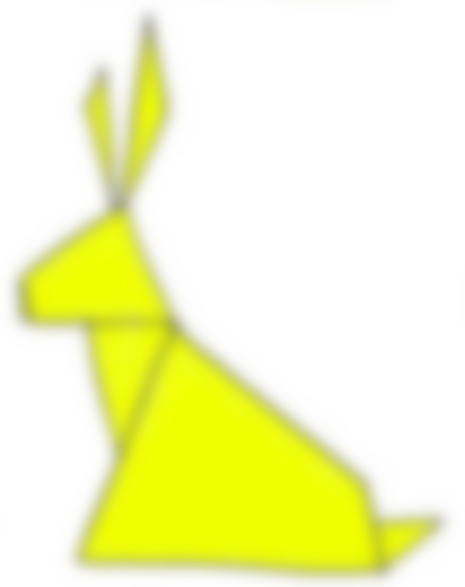
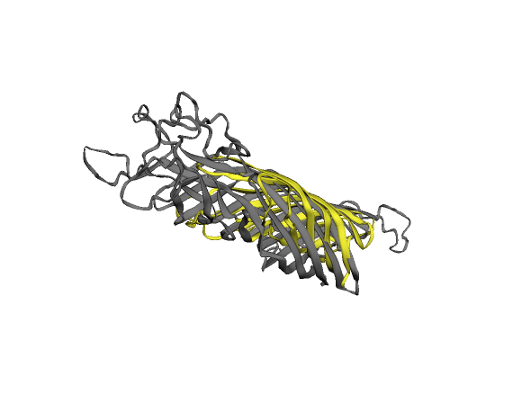
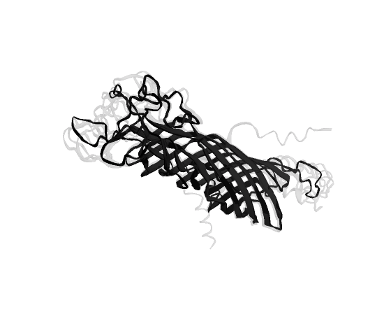
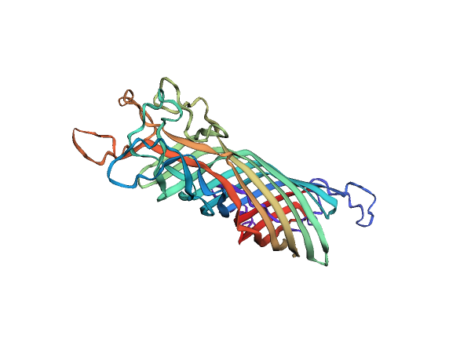
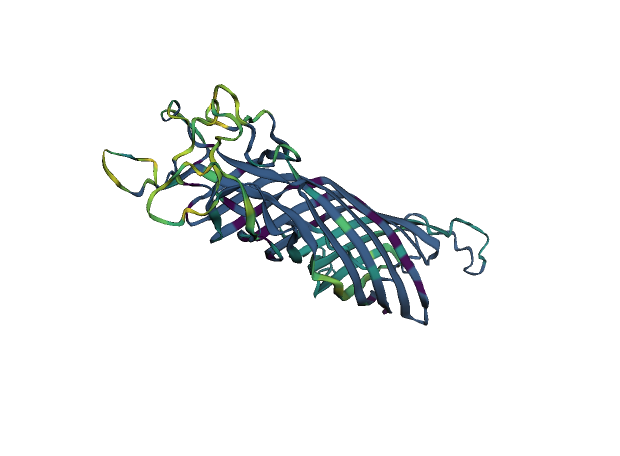

## Foldvis


<!-- https://gist.github.com/DavidWells/7d2e0e1bc78f4ac59a123ddf8b74932d -->
<p align="center">
    
</p>

Protein visualization without the pain. `Foldvis` currently supports `jupyter notebook`-based exploration of:

- alignment of protein structures
- color by label (pLDDT, N to C terminus)
- display `AlphaFold2` model variance
- load and display variation from a multiple sequence alignment

The awesome `Anvio` has a [structure module](https://merenlab.org/2018/09/04/getting-started-with-anvio-structure/), should you be dissatisfied with `Foldvis`. However, I wanted a more lightweight tool, which to my knowledge did not exist, so I made one. PRs and suggestions welcome (also see TODOs below)!


### Install

```bash
# Dependencies
conda create -n foldvis -c bioconda -c conda-forge python=3.9 jupyter screed numpy biopython matplotlib py3dmol && conda activate foldvis
# Foldseek conda package not current version last time I checked
# For Mac
wget https://mmseqs.com/foldseek/foldseek-osx-universal.tar.gz; tar xvzf foldseek-osx-universal.tar.gz; export PATH=$(pwd)/foldseek/bin/:$PATH
# For other systems: https://github.com/steineggerlab/foldseek#installation

# This package
git clone github.com/phiweger/foldvis
cd foldvis
pip install -e .

# To run the example below
unzip -d data/full data/full.zip
wget https://files.rcsb.org/download/1BXW.pdb
```


### Usage

Run the code below in a Jupyter notebook for the structures to render (`jupyter notebook example.ipynb`).

We will explore the protein structure of the full-length `ompA` gene of [Chlamydiifrater volucris](https://www.ncbi.nlm.nih.gov/genome/?term=Chlamydiifrater+volucris). It has 6 more (truncated) homologs of that gene in its genome. We are interested here in the variation amongst these copies.

We already used `AlphaFold2` to fold `OmpA` using the awesome `ColabFold` ([code](https://github.com/sokrypton/ColabFold), [preprint](https://www.biorxiv.org/content/10.1101/2021.08.15.456425v3)) and saved the data under `data/full`


```python
import numpy as np

from foldvis.io import load_conserved
from foldvis.models import Fold, AlphaFold
from foldvis.vis import *  # yes I know, whatever


# Load alphafold model
af = AlphaFold('data/full')
# Pick the best model out of the 5 predictions
model = af.models[1]


# Load a PDB structure model
ref = Fold('data/1BXW.pdb')
# Align proteins and transform the query into the coordinate space of the target
tm, aln = ref.align_to(model, mode=2, minscore=0.3)
print(f'TM-score: {tm}')
# params passed to foldseek, see "foldseek search -h"
aln.rename_chains_({'A': 'B'})


# How does the structure we predict compare to experimentally validated ones?
view = plot_superposition([model, aln], {'A': 'grey', 'B': 'yellow'})
view.show()
```


<p align="center">
    
</p>


```python
# How certain is the AlphaFold2 of its prediction?
print(f"pLDDT for best model is {round(np.mean(model.annotation['plddt']), 2)}")
# Aim for > 50 seems ok

# Overlay the 5 models AlphaFold2 generates to assess model variation
view = plot_alphafold(af)
view.show()
```


<p align="center">
    
</p>


```python
# We can color properties of the residues in our structure.
# What is available out of the box?
print(f'Available annotations: {list(model.annotation.keys())}')

# Color protein from N (violet) to C terminus (red)
# Colormaps are from matplotlib: 
# https://matplotlib.org/stable/tutorials/colors/colormaps.html
view = plot_annotation(model, label='position', palette='rainbow')
view.show()
```


<p align="center">
    
</p>


```python
# Generate an MSA, e.g. here we used MAFFT
# linsi data/Cfvo_O50_ompA.fa > data/msa.faa"
fp = 'data/msa.faa'
ref = 'PPFHKHLK_00058 porin [the longest copy, i.e. the actual ompA]'

model.annotate_('variation', [1-i for i in load_conserved(fp, ref)])
view = plot_annotation(model, 'variation', 'viridis')
view.show()
```


<p align="center">
    
</p>


### TODOs

- [ ] deposit `3Dmol.js` code locally instead of using CDN
- [ ] install using `pip`
- [ ] allow display of binding sites, like [here](https://merenlab.org/2020/07/22/interacdome/)

